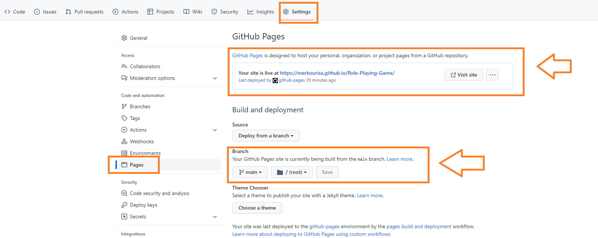
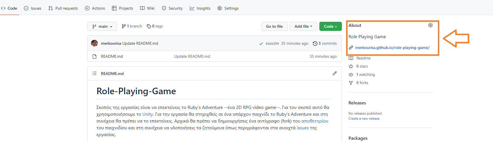

# Role-Playing-Game

Σκοπός της εργασίας είναι να επεκτείνεις το Ruby's Adventure, ένα 2D RPG video game. Για το σκοπό αυτό θα χρησιμοποιήσεις τo [Unity](https://unity.com/). Αρχικά θα πρέπει να δημιουργήσεις ένα αντίγραφο (fork) του [αποθετηρίου](https://github.com/merkourisa/Role-Playing-Game) του παιχνιδίου και στη συνέχεια να υλοποιήσεις τα ζητούμενα όπως περιγράφονται στα ανοιχτά [issues](https://github.com/merkourisa/Role-Playing-Game/issues) της εργασίας.

## Initial Settings
- Από την στιγμή που έχεις κάνει αντιγραφή (fork) το [αποθετήριο](https://github.com/merkourisa/Role-Playing-Game) του παιχνιδιού, θα πρέπει να έχει κατέβει στο προσωπικό σου github αποθετήριο το εκτελέσιμο του παιχνιδιού.

- Ενεργοποίησε το Github Pages στα setting του προσωπικού σου repository  και *άλλαξε το λινκ στο **About** του αποθετηρίου σου ώστε να δείχνει τη σελίδα του παιχνιδιού σου.*

**Προσοχή:** Για να βαθμολογηθεί το παιχνίδι πρέπει να βρίσκεται υποχρεωτικά στην προσωπική σας Github Page.

## Βαθμολόγηση
Λαμβάνοντας υπόψη το ποσοστό της εργασίας στον τελικό βαθμό, με άριστα το 6 τα παραδοτέα βαθμολογούνται ως εξής:
- Αλλαγές στο παιχνίδι όπως περιγράφονται στο [παραδοτέο 1](https://github.com/merkourisa/Role-Playing-Game/issues/1): μέχρι +2 μονάδες. 
- Αλλαγές στο παιχνίδι όπως περιγράφονται στο [παραδοτέο 2](https://github.com/merkourisa/Role-Playing-Game/issues/2): μέχρι +2 μονάδες.
- Αλλαγές στο παιχνίδι όπως περιγράφονται στο [παραδοτέο 3](https://github.com/merkourisa/Role-Playing-Game/issues/3): μέχρι +2 μονάδες.

Τα τρία καλύτερα παιχνίδια θα βαθμολογηθούν με +2 βαθμούς Bonus

## Προθεσμίες
- [παραδοτέο 1](https://github.com/merkourisa/Role-Playing-Game/issues/1): μέχρι 11/11/2022 
- [παραδοτέο 2](https://github.com/merkourisa/Role-Playing-Game/issues/2): μέχρι 16/12/2022
- [παραδοτέο 3](https://github.com/merkourisa/Role-Playing-Game/issues/3): μέχρι 13/1/2023

## Resources

- [Tutorial](https://learn.unity.com/project/ruby-s-2d-rpg?uv=2020.3)
- [Game Example](https://psarrask.github.io/Pacman/)

## Απορίες

Για τυχόν απορίες όσον αφορά τα παραδοτέα υπάρχουν τα ανοιχτά [issues](https://github.com/merkourisa/Role-Playing-Game/issues), όπου μπορείτε όχι μόνο να ρωτάτε αλλά και να απαντάτε σε απορίες συμφοιτητών σας. 
